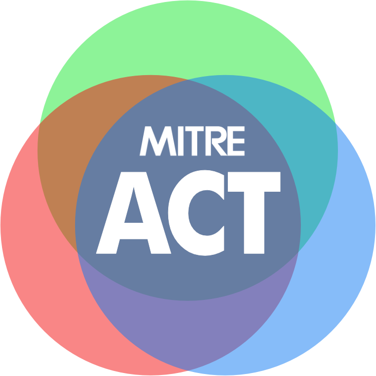

# MITRE Adaptive Capabilities Testing (ACT)

The MITRE Adaptive Capabilities Testing (ACT) framework is a comprehensive approach to security and risk assessment that facilitates and encourages risk-based decision-making. This repository contains the web implementation of the ACT program, including the ACT Handbook, methodology documentation, and supporting resources.

## About ACT

The MITRE Adaptive Capabilities Testing (ACT) framework moves security assessment beyond traditional compliance-focused approaches to a capability-focused, risk-based methodology that provides actionable insights for decision-makers.

### Key Principles

- **Risk-driven** rather than compliance-driven
- **Capability-oriented** rather than control-oriented
- **Multiple risk information sources** beyond just control compliance
- **Understandable and actionable** for leadership decision-making

# ACT Materials

Coming soon.
