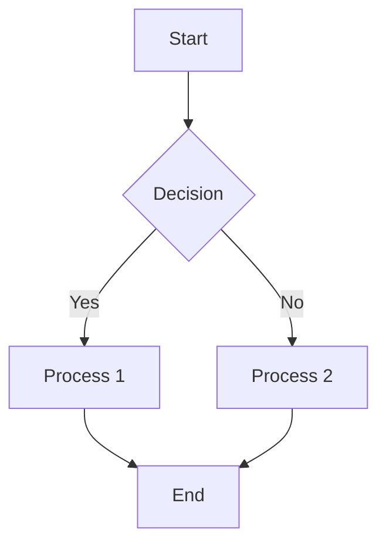

# Required Modules

::UAlert{type="info" title="Module Dependencies"}
This document outlines the essential Nuxt modules needed for full functionality of the SAF site.
::

## Core Modules

For the SAF site to function properly with all features, several additional Nuxt modules need to be installed and configured:

### 1. Icon Support

The `@nuxt/icon` module is required for icon syntax like `i-heroicons-light-bulb` to work in both Vue templates and markdown content:

```bash
# Installation
pnpm add -D @nuxt/icon
```

Update your `nuxt.config.ts`:

```typescript
export default defineNuxtConfig({
  modules: [
    // other modules
    '@nuxt/icon',
  ],
})
```

### 2. Image Optimization

The `@nuxt/image` module provides optimized image handling, responsive images, and image transformations:

```bash
# Installation
pnpm add -D @nuxt/image
```

Update your `nuxt.config.ts`:

```typescript
export default defineNuxtConfig({
  modules: [
    // other modules
    '@nuxt/image',
  ],
  image: {
    // Configuration options
    quality: 80,
    // Add additional providers or options as needed
  }
})
```

### 3. Mermaid Diagrams

For rendering Mermaid diagrams in documentation and markdown:

```bash
# Installation
pnpm add -D nuxt-content-mermaid
```

Update your `nuxt.config.ts`:

```typescript
export default defineNuxtConfig({
  modules: [
    // other modules
    '@nuxt/content',
    'nuxt-content-mermaid',
  ],
})
```

::UAlert{type="warning"}
The order of modules matters in some cases. Add `nuxt-content-mermaid` after `@nuxt/content`.
::

### 4. Diagram Example

Once installed, you can use Mermaid diagrams in documentation like this:

````markdown

````

Which renders as:


## UI Enhancement Modules

In addition to the core modules, these modules enhance the UI capabilities:

### Color Mode

For supporting light/dark theme switching:

```bash
# Installation
pnpm add -D @nuxtjs/color-mode
```

Update your `nuxt.config.ts`:

```typescript
export default defineNuxtConfig({
  modules: [
    // other modules
    '@nuxtjs/color-mode',
  ],
  colorMode: {
    classSuffix: ''
  }
})
```

## Development Modules

These modules enhance the development experience:

### DevTools

For improved debugging and development experience:

```bash
# Installation
pnpm add -D @nuxt/devtools
```

Update your `nuxt.config.ts`:

```typescript
export default defineNuxtConfig({
  modules: [
    // other modules
    '@nuxt/devtools',
  ],
})
```

## Module Installation Script

For convenience, here's a script that installs all required modules:

```bash
#!/bin/bash
pnpm add -D @nuxt/icon @nuxt/image nuxt-content-mermaid @nuxtjs/color-mode @nuxt/devtools
```

Save this as `install-modules.sh` and run with:

```bash
chmod +x install-modules.sh
./install-modules.sh
```

::UAlert{type="success" title="Improved Documentation"}
With these modules installed, our documentation will support icons, optimized images, and diagrams, greatly enhancing the developer and user experience.
::